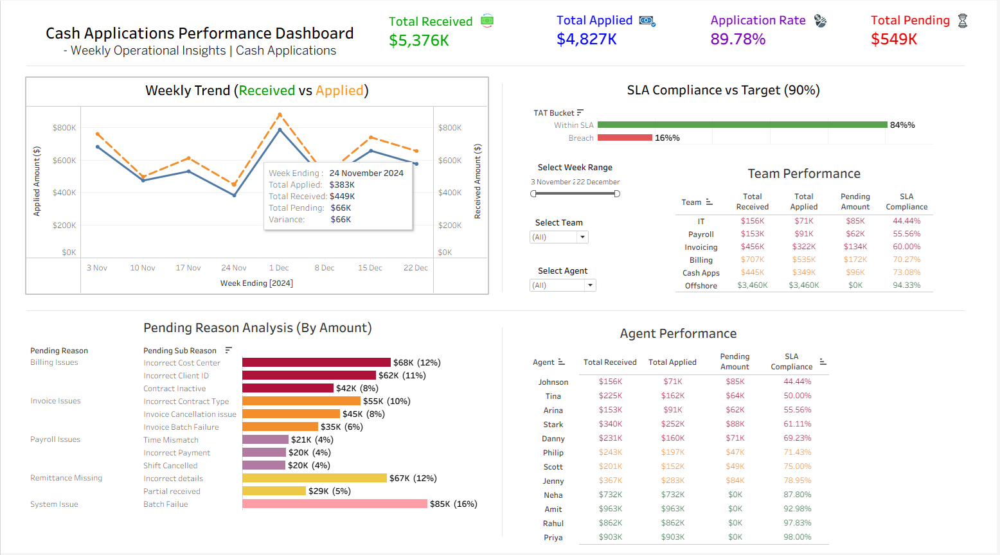
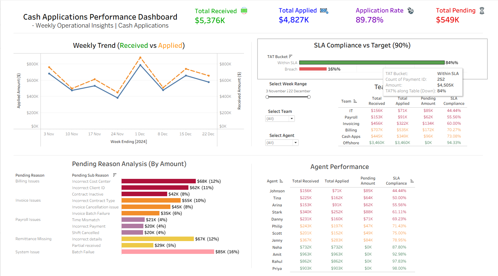
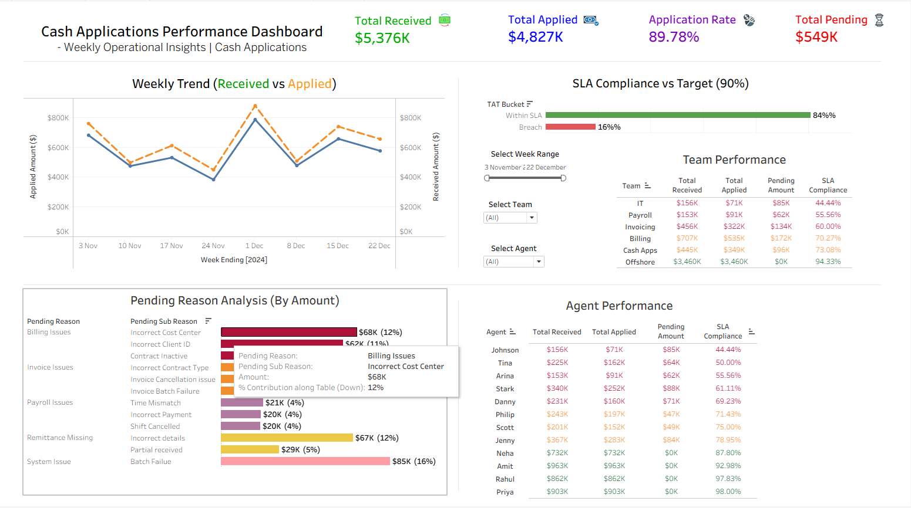
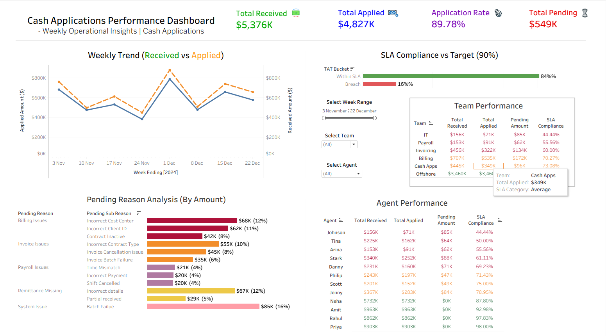
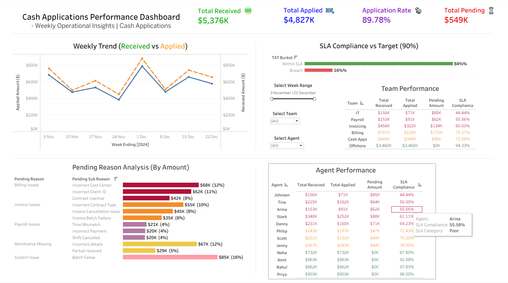

# 💰 Cash Application Dashboard (Tableau)

## 📌 Overview

This project analyzes the Cash Application process in Accounts Receivable, focusing on payment allocation efficiency, unapplied cash, and SLA adherence.

## 🎯 Business Problem

Organizations face delays in applying customer payments, leading to:

* Increase in unapplied cash
* Customer disputes
* Impact on working capital

## 📊 Dashboard Features

* Total Cash Received vs Applied
* Unapplied Cash Trend
* SLA % Performance
* Agent-wise Productivity
* Aging Analysis of Pending Cash

## 📈 Key Insights

* Identified peak delays in payment application during month-end
* Highlighted agents with low SLA adherence
* Unapplied cash spikes linked to missing remittance details

## 🛠 Tools Used

* Tableau
* SQL (for data extraction)
* Excel (data preparation)

## 📷 Dashboard Preview

### Weekly Trend

### SLA Compliance

### Pending Reason

### Team Performance

### Agent Performance

## 🚀 How to Use

Download the .twbx file and open in Tableau Desktop / Tableau Public.

## 👤 Author

Harvinder Singh
Operations & Quality | Data Analytics | Power BI | Tableau
